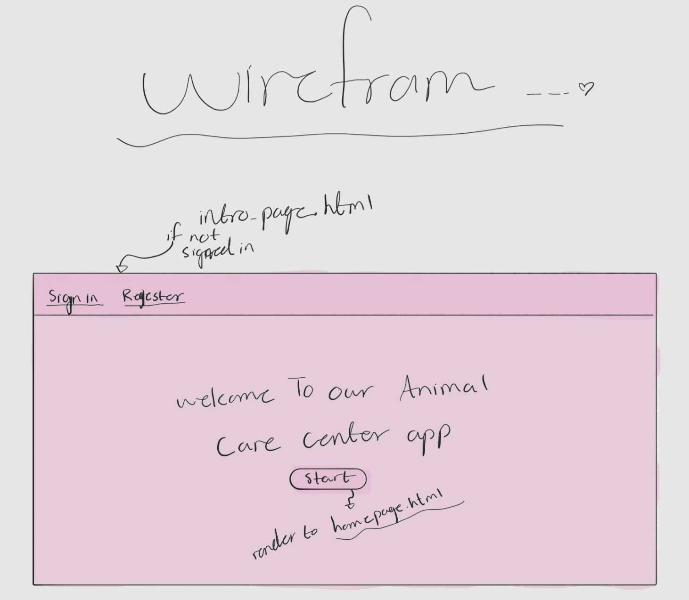
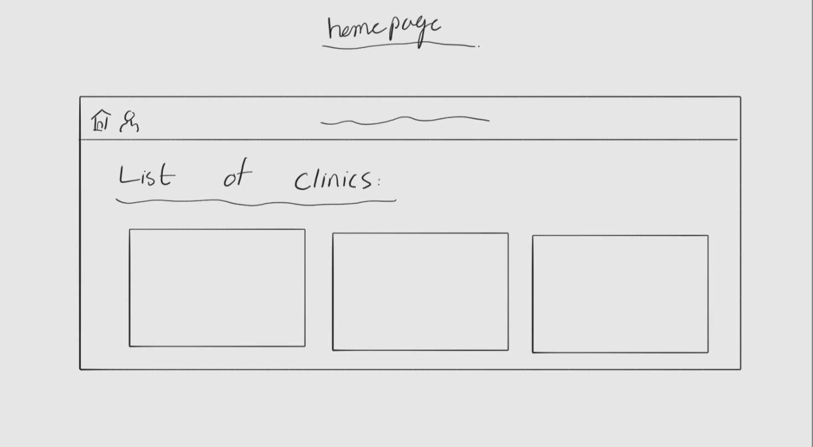
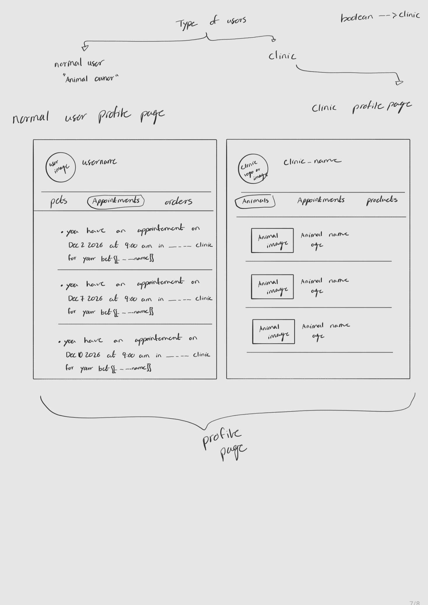
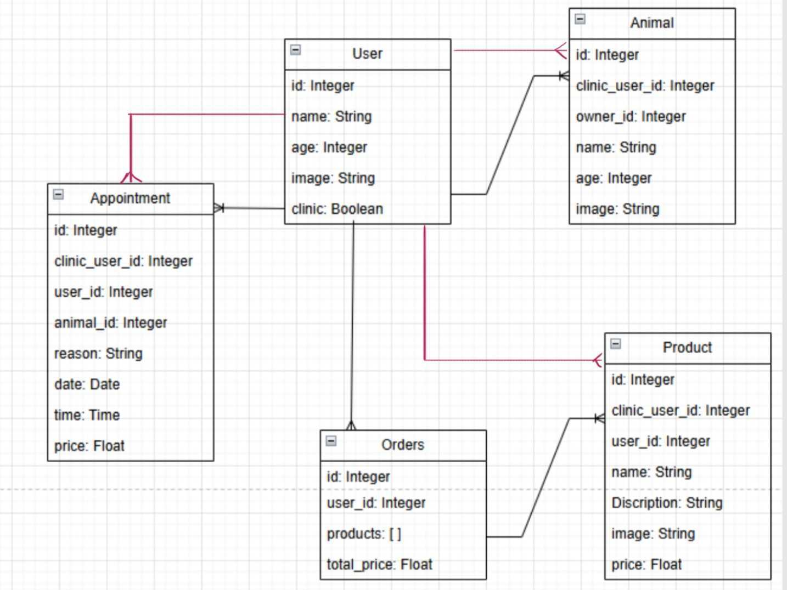

# Project 3 : Animal Care Center

## Date: 6/5/2026

### Created By: Masooma Ebrahim

[GitHub](https://github.com/masooma99)
[LinkedIn](https://www.linkedin.com/in/masoomaebrahim99/)

### ***Description***
#### Animal Care Center is a web site where clinics can list their products and services for the users, and the users can adopt animals, make orders to buy the products from the clinics, and set an appointments for their pets in a selected clinic.
***

### ***Technologies Used***
* python
* html
* js
***

### ***Getting Started***

#####

##### A Trello board was used to keep track of development progress and can be viewed [https://trello.com/b/Ptno9RyB/animal-care-center]
***

### WireFrame
Intro page

Home page

Profile page

### ERD

### ***Future Updates***

- [ ]
- [ ]
- [ ]
***
